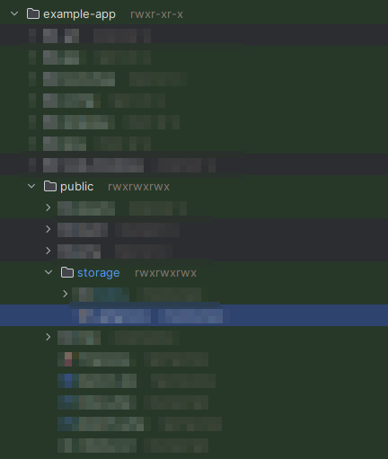
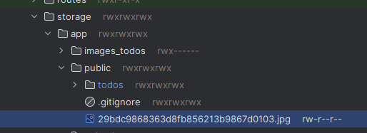

# PHP Laravel 에서 파일 업로드 시도

##### 📝 2023-12-18

### 사전 준비
```php
filesystems.php

/*
|--------------------------------------------------------------------------
| Symbolic Links
|--------------------------------------------------------------------------
|
| Here you may configure the symbolic links that will be created when the
| `storage:link` Artisan command is executed. The array keys should be
| the locations of the links and the values should be their targets.
|
*/

'links' => [
    public_path('storage') => storage_path('app/public'),
],
```

아래쪽에 보면 links 라고 해서 배열을 받는 부분이 있습니다.


```bash
php artisan storage:link
```

다음 명령어를 실행하게 되면



`/public/storage` 라는 폴더가 생겼을것입니다.


이걸 cli로 확인해보면 다음과 같이 storage 가 심볼릭 링크를 통해 `storage/app/public`으로 이동하는걸 확인 할수있습니다.

https://laravel.kr/docs/9.x/filesystem 에서는 이렇게 말합니다.
웹에서 이러한 파일에 액세스할 수 있도록 하려면 `public/storage` 를 `storage/app/public` 으로 심볼릭 링크를 생성해야 합니다. 

<br>

### View

```html
<form action="/todos/store" method="POST" enctype="multipart/form-data">
    <input type="file" name="todos_image">
</form>
```
사용자 페이지에서 파일만 받는 폼을 만들어줍니다.

### Contoller

```php
public function store(Request $request)
{
    // 암호화 된 파일 이름
    $fileHashName = '';
    // 원래 파일 이름
    $fileOriginalName = '';

    // hasfile 에는 form에서 받은 name을 적어줍니다.
    if($request->hasfile('todos_image')) { 
        // 파일 정보를 가져옵니다
        $file = $request->file('todos_image');

        // 파일의 원래 이름을 저장합니다.
        $fileOriginalName =  $file->getClientOriginalName();

        // 확장자를 저장합니다.
        $ext = $file->getClientOriginalExtension();

        // 파일을md5로 감싸고 확장자를 넣어줍니다.
        $fileHashName = md5($fileName) . '.' . $ext;

        // 위에서 storage_path가 app/public 이었으므로 앞에 public만 적어줍니다.
        $path = $file->storeAs( 'public', $fileHashName );
    }


    $file = array(
        'image_hash_id' => $fileHashName,
        'image_name' => $fileOriginalName,
        'date' => date('Y-m-d')
    );

    Todos::create($file);

}
```



다음과 같이코드를 작업하게 되면 `/storage/app/public` 안에 hash로 저장해둔 파일명의 파일이 존재 합니다.