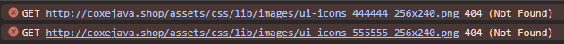

# jQuery CSS image not found



# RRD - React Router Dom

RRD 사용하는걸 알아봅시다.

## RRD 이란?

리액트 라우터는 화면 전환을 도와주는 역할  
웹에서 a tag를 통해 다른 페이지로 이동 한다면,  
React 에서는 React-Router을 통해 Link 태그를 사용하여 화면을 전환합니다.

일반적으로 <br />
웹에서 a tag 를 통해서 새로고침이 되며 이동하는걸 **MPA (Multi Page Application)** 이라고 하고 <br />
**React** 같은 경우를 **SPA(Single Page Application, CSR(Cliend Side Rendering)** 이라고 합니다.

## BrowserRouter

1. Link Component를 to 속성에 이동할 경로를 작성
2. Route Component path 속성을 Link의 to 속성과 매핑 component의 컴포넌트 경로 기술
3. 새로고침을 하면 경로를 찾지 못하여 에러를 발생
4. History Api 사용

### install Router Module

cmd 또는 powershell을 열어서 다음과 같이 설치를 해줍니다.

```bash
npm install react-router-dom@6
```

### import Router

`react-router-dom` 을 가져옵니다.

```js
// import Router
import { BrowserRouter, Route, Routes } from "react-router-dom";
```

### BrowserRouter

기본 구조는 최상단 element를 `<BrowserRouter>` tag가 감싸게 됩니다.

```js
<BrowserRouter>
  <div className="App"></div>
</BrowserRouter>
```

### Route
최상단 element 아래 위치하게 되며 `<Routes>` 태그가 `<Route>` 태그를 감싸는 형태이며 `<Route>` 태그는 path 와 element 속성을 가지고 있습니다.\
**path** 속성은 경로 url을 적는 공간이며  
**element** 속성은 보여줄 component 를 적는 공간 입니다.

```js
<BrouserRouter>
  <div className="App">
    <Routes>
      <Route path="/" element={<Home />} />
    </Routes>
  </div>
</BrouserRouter>
```
