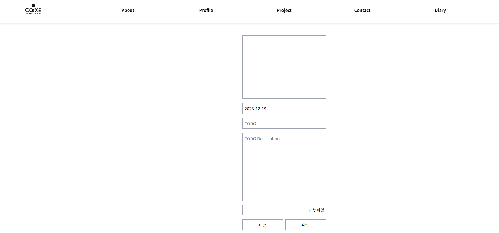
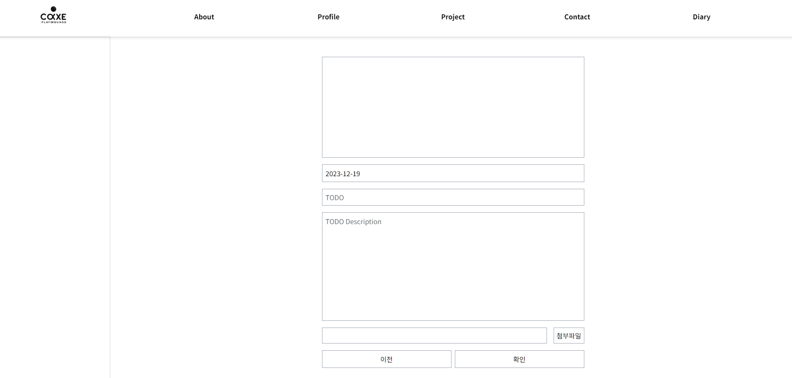
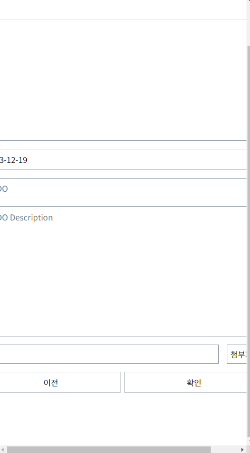
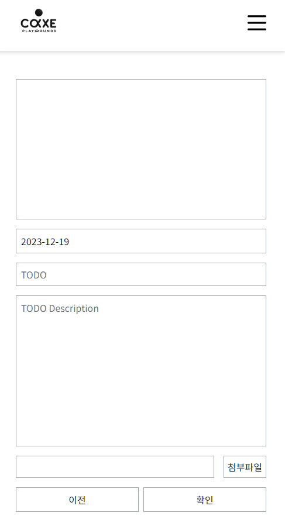

@ -1,39 +0,0 @@
### 🐥 오늘의 TIL

[ jQuery ui Sortable 정리 ](https://github.com/GangOn0215/dev-til/blob/4886a5d4340bed6229f05e98a64778223cfc954d/DEV/Backend/Framework/Laravel/image-upload.md)

#### todos project 반응형으로 제작

##### 에피소드

[ **list** ]

  

[ **create** ]

위 처럼 lists 랑 create 크기 차이가 많이 났습니다.
거의 모든 부분을 100%로만 주다보니 생겨난 일인데 `.todo-container` 부분을 `min-width: 39rem` 줬더니

[ **create** ]

생각보다 볼만해졌는데 

반응형 부분 에서 박살나버립니다.

rem은 분명 반응형에서 유용한걸로 아는데 왜이러지 고민하다 min- 부분을 빼버립니다.

`min-width: 39rem;` 에서 `width: 39rem;` 을 해주니깐 반응형 깔끔하게 먹히고 원하는대로 나와주네요!