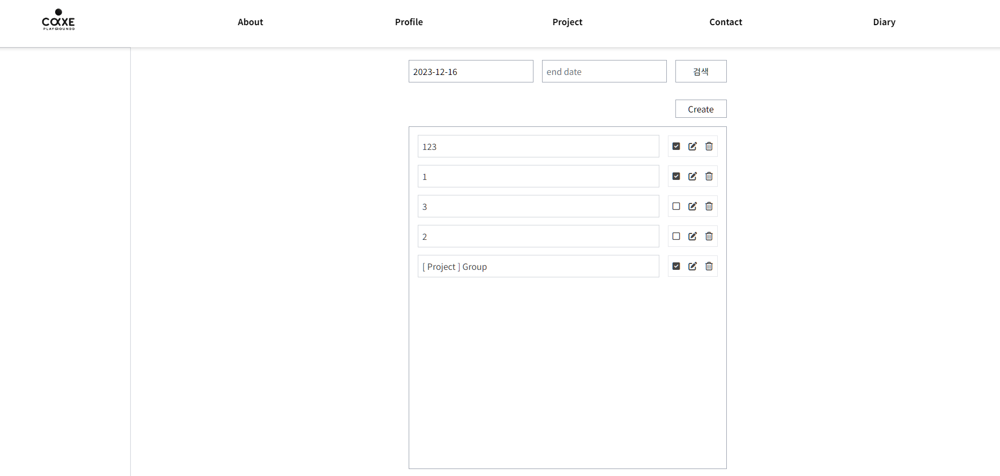
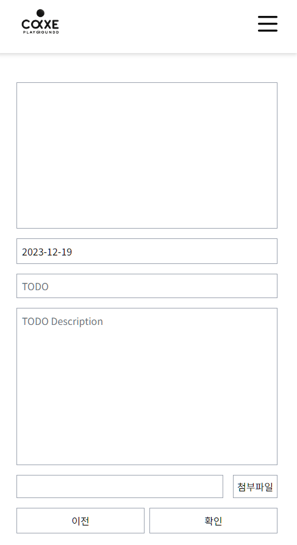

### ❄️ 2023-12-19

#### todos list 반응형으로 제작

[ **list** ]

  

[ **create** ]

위 처럼 lists 랑 create 크기 차이가 많이 났습니다.
거의 모든 부분을 100%로만 주다보니 생겨난 일인데 `.todo-container` 부분을 `min-width: 39rem` 줬더니

[ **create** ]

1
생각보다 볼만해졌는데 

반응형 부분 에서 박살나버립니다.

rem은 분명 반응형에서 유용한걸로 아는데 왜이러지 고민하다 min- 부분을 빼버립니다.

`min-width: 39rem;` 에서 `width: 39rem;` 을 해주니깐 반응형 깔끔하게 먹히고 원하는대로 나와주네요!